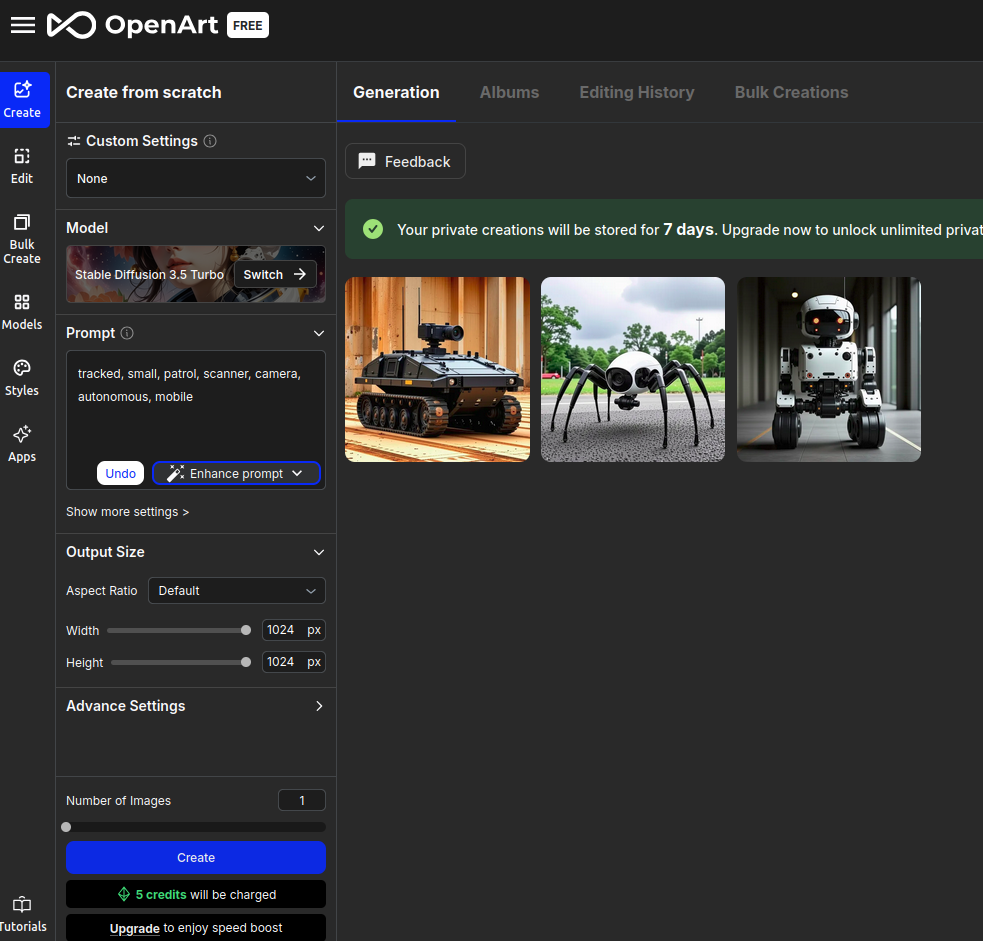
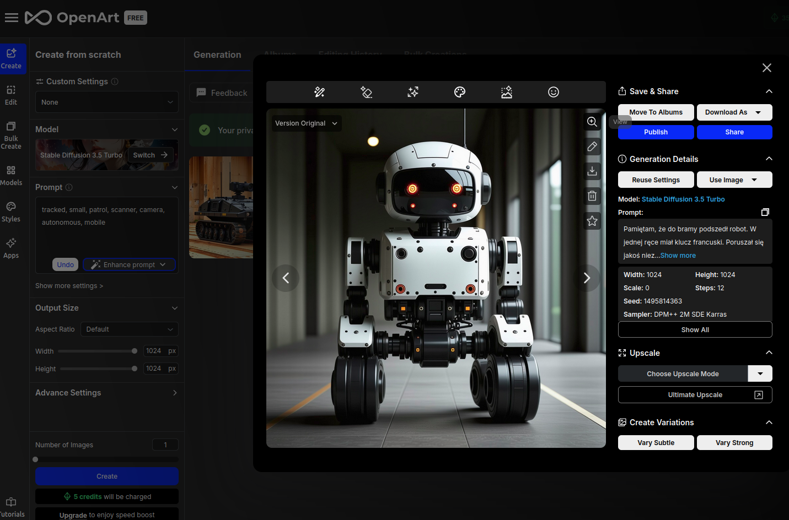
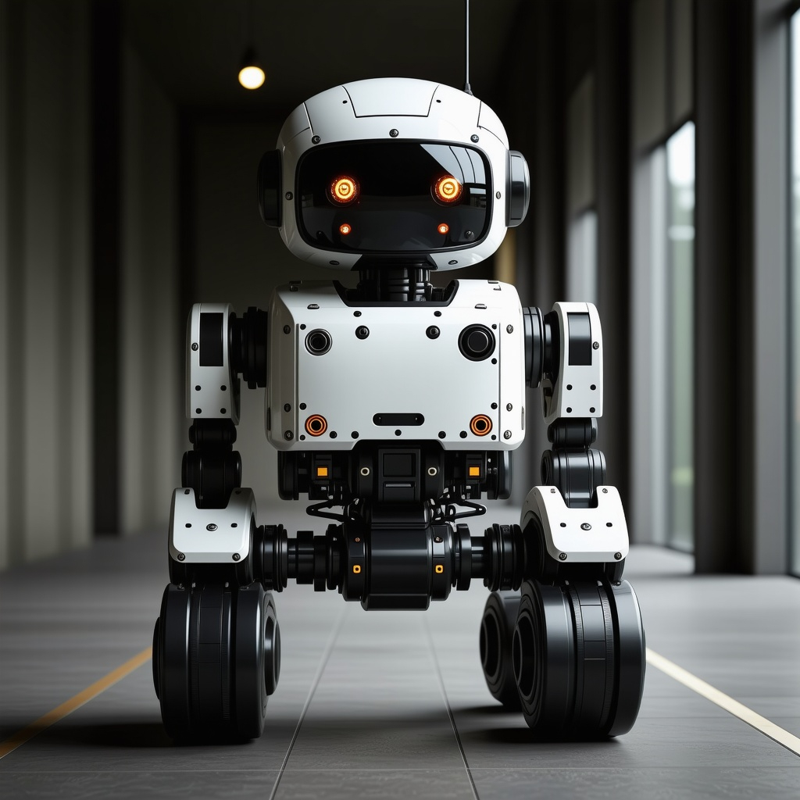
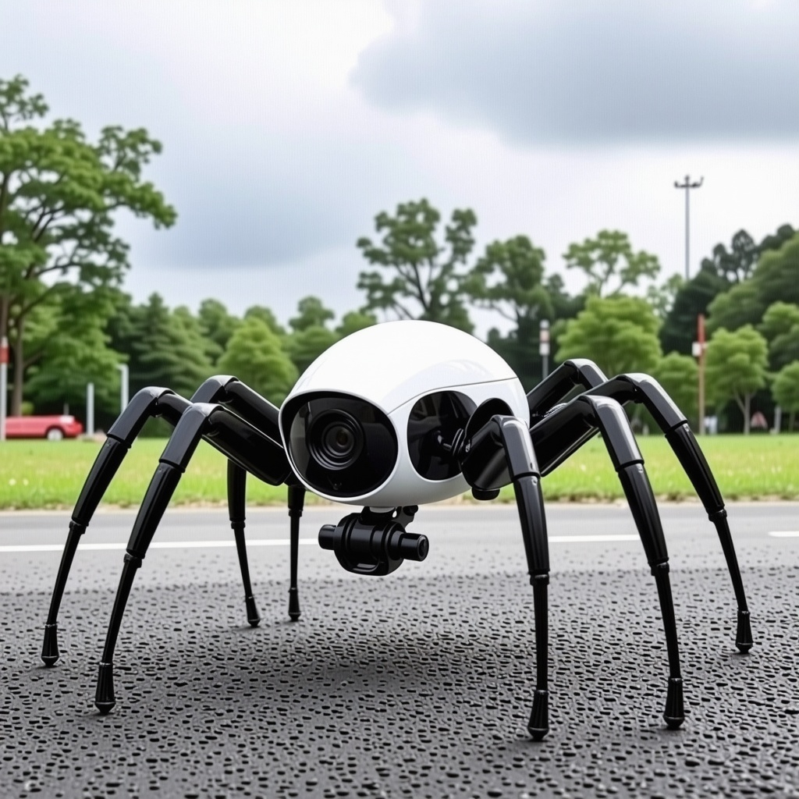
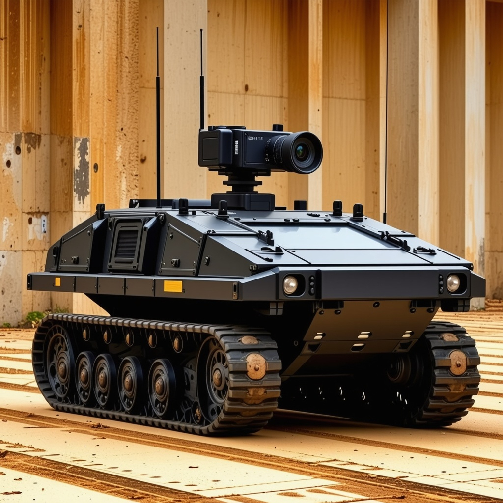

# 1.
GET:
```curl
curl --location 'https://centrala.ag3nts.org/data/***{{CENTRAL-API-KEY}}***/robotid.json'
```
Response:
```json
{
  "description": "Przejeżdżał koło mnie taki jeden... mówię przejeżdżał, bo on nie miał nóg, tylko gąsienice. Takie wiesz... jak czołg. Niski był. To chyba robot patrolujący. Jeździł w kółko i tylko skanował w koło tymi swoimi kamerami. To było stresujące, ale na szczęście mnie nie zauważył. Dobrze się ukryłem."
}
```

# 2.
POST:
```curl
curl --location 'https://api.anthropic.com/v1/messages' \
--header 'x-api-key: ***{{CLAUDE-API-KEY}}***' \
--header 'anthropic-version: 2023-06-01' \
--header 'content-type: application/json' \
--data '{
    "model": "claude-3-5-sonnet-20241022",
    "max_tokens": 1024,
    "messages": [
        {
            "role": "user", 
            "content": "<rules>-Extract keyword describing the trobot -Present response in eanglis -Do not add any prefixes - Return only keywords separeted with ,</rules>: Przejeżdżał koło mnie taki jeden... mówię przejeżdżał, bo on nie miał nóg, tylko gąsienice. Takie wiesz... jak czołg. Niski był. To chyba robot patrolujący. Jeździł w kółko i tylko skanował w koło tymi swoimi kamerami. To było stresujące, ale na szczęście mnie nie zauważył. Dobrze się ukryłem." }
    ]
}'
```
Response:
```json
{
    "id": "msg_016bink5XnDqVinA5zzGsjgo",
    "type": "message",
    "role": "assistant",
    "model": "claude-3-5-sonnet-20241022",
    "content": [
        {
            "type": "text",
            "text": "tracked, small, patrol, scanner, camera, autonomous, mobile"
        }
    ],
    "stop_reason": "end_turn",
    "stop_sequence": null,
    "usage": {
        "input_tokens": 166,
        "output_tokens": 16
    }
}
```

# 3.
WEB:
https://openart.ai/create?ai_model=stable-diffusion-v35-large%2Fturbo


# 4.
Get url to picture by using maginfing glass button:


# 5.
POST:
```curl
curl --location 'https://centrala.ag3nts.org/report' \
--header 'Content-Type: application/json' \
--data '{
    "task": "robotid",
    "apikey": "***{{CENTRAL-API-KEY}}***",
    "answer": "https://cdn.openart.ai/uploads/image_UsEg60bF_1731525670549_raw.jpg"
}'
```

Response:
```json
{
    "code": 0,
    "message": "{{FLG:INFILTRACJA}}"
}
```

# Generated images:


