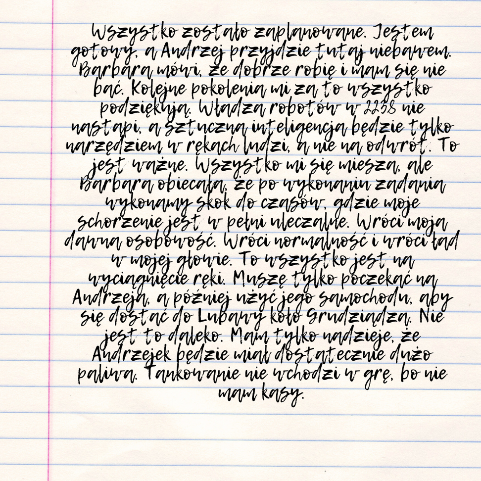

Extract images:
https://tools.pdf24.org/en/extract-images

Extract text from pdf:
https://tools.pdf24.org/en/convert-from-pdf

Ask Claude to find answers:
Add files to context:

[notatnik-rafala.txt](ready_data/notatnik-rafala.txt)

User:
```
Find answeres for questions in provided data:
{
    "01": "Do którego roku przeniósł się Rafał",
    "02": "Kto wpadł na pomysł, aby Rafał przeniósł się w czasie?",
    "03": "Gdzie znalazł schronienie Rafał? Nazwij krótko to miejsce",
    "04": "Którego dnia Rafał ma spotkanie z Andrzejem? (format: YYYY-MM-DD)",
    "05": "Gdzie się chce dostać Rafał po spotkaniu z Andrzejem?"
}
```

AI:
```
Let me analyze the provided text and images to answer your questions:
"01": Based on the text fragments, Rafał seems to have traveled to the 20... year (exact year is unclear in the fragments), but there's a mention that after 2024 things would change according to Adam's stories about drones.
"02": From the text, Adam seems to have chosen the specific year ("Dlaczego Adam wybrał akurat ten rok?"). Though there's also mention of Azazel, Adam appears to be the one who made the initial decision about the time travel.
"03": Based on the text mentioning "Znalazłem miejsce schronienia" and the reference to "Iz 2:19", it appears to be a cave (as Isaiah 2:19 refers to caves in rocks).
"04": 2024-11-11 (This date is explicitly mentioned in one of the last entries: "11 listopada 2024")
"05": According to the handwritten note in the image, Rafał wants to get to "Lubawy koło Grudziądza" (Lubawa near Grudziądz).
```

User:
```
{
    "code": -340,
    "message": "Answer for question 01 is incorrect",
    "hint": "uwzględnij wszystkie fakty podane w tekście, w szczególności odwołania do wydarzeń",
    "debug": "You sent: 2020"
}
```

AI:
```
I apologize - let me reanalyze the text more carefully regarding the year Rafał traveled to, looking specifically at the technological timeline mentioned:
According to the text:

There are mentions of work on LLM technology
Specifically mentions that GPT-2 needs to be created first, followed by GPT-3
GPT-2 is mentioned as having been created after Rafał delivered the research ("No i powstało GPT-2. Słyszałem w wiadomościach, a to wszystko dzięki badaniom, które dostarczyłem")

Given that GPT-2 was released in 2019, and considering the chronological order of events mentioned in the text, Rafał must have traveled to around 2018-2019, just before GPT-2's creation, to deliver the research that would lead to its development.
So the answer to question "01" should be: 2018
This makes sense in the context as it would allow for the subsequent development of GPT-2 and GPT-3, while also aligning with the technological timeline mentioned in the diary entries.
```

User:
```
{
    "code": -340,
    "message": "Answer for question 04 is incorrect",
    "hint": "Rafał odwołuje się względnie do tej daty i nie wymienia jej dosłownie w tekście",
    "debug": "You sent: 2024-11-11"
}
```

AI:
```
Let me correct my analysis for question "04" by looking at the text more carefully:
In the diary entries, Rafał writes "To już jutro" when referring to the meeting with Andrzej ("Andrzejek... Andrzejek... słyszę w głowie Twoje kroki i czekam na Ciebie. To już jutro.")
Since this entry is dated "11 listopada 2024", and the meeting is "tomorrow", the actual meeting with Andrzej is scheduled for:
"04": 2024-11-12
This is more precise as it takes into account that Rafał wrote about the meeting being "tomorrow" relative to November 11, 2024.
```